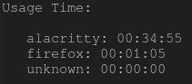

A screentime monitoring tool, shows how much time are you really using certain apps. It work nicely with i3status or py3status on I3 window manager for example :)



# Install:

## From crates.io:

`cargo install screentime`

## Arch:

`yay screentime` (or other AUR manager)

## Locally:

`cargo install`

# Usage:

`screentime --help`

```
A screentime monitoring tool. Firstly, start this program with no arguments (daemon mode)

Usage: screentime [OPTIONS] [COMMAND]

Arguments:
  [COMMAND]
          Client commands

          Possible values:
          - hms:         Print total screentime in HH:MM:SS format
          - total:       Print total screentime in seconds
          - summary:     Print a nice-looking summary
          - raw-summary: Print a summary in raw JSON

Options:
  -c, --config <FILE>
          Specify a config path

  -h, --help
          Print help information (use `-h` for a summary)
```

# Config:

Config path: `$HOME/.config/screentime/config.toml`

Variables:

 - `port` (The port for the listening deamon (default `9898`)
 - `seconds_before_afk` (After how much seconds of inactivity assumes AFK (default `30`)
 - `snapshot_interval_in_seconds` (How often program saves its state on disk (default `10`)

# How it works:

It just maintains a counter HashMap updated every second by one thread. Other thread has an HTTP API for the client to access the usage time. It uses only cross-platform libraries, so it should work on all three popular OSes.


# Features:

- [x] Linux, Windows and MacOS
- [x] Measure total screentime
- [x] AFK feature
- [x] Configurable
- [x] Simple client in a binary


# Contributing:

Feel free to open an issue, or just make a pull request. If you see any improvements to make the code better in any way, open a PR. I'd be happy to welcome new contributors :)
